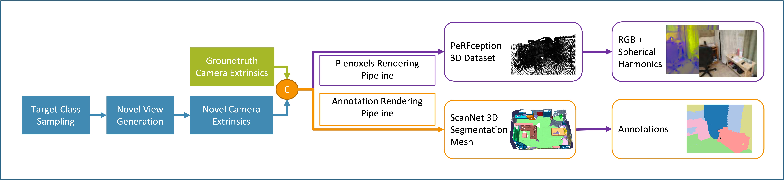
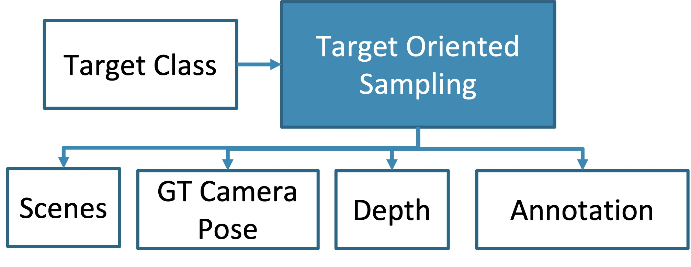
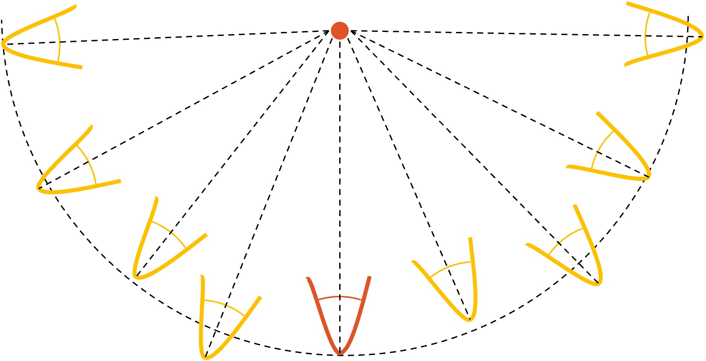

# Semantic Segmentation using Implicit Representation
### Quick Links:
[Report]() - [Poster](static/Poster.pdf)

### Author Info:
- Mohammad Rashed [[Github](https://github.com/m13ammed/)]
- Karim ElGhandour [[Github](https://github.com/kghandour/) - [Website](https://kghandour.com)]



### Abstract
This paper proposes a method for improving the per-
formance of semantic segmentation models using implicit
representation called Plenoxels. The method involves using
Plenoxels as an auxiliary input to enhance the performance
of the models by combining the implicit representation with
RGB information. Additionally, this work proposes an auto-
mated pipeline for novel synthetic views generation for tail
class sampling using Plenoxels radiance field. The results
showed that the combination of rendered images and spher-
ical harmonics effectively captures the information present
in camera images and incorporating projected spherical
harmonics can potentially enhance the performance of se-
mantic segmentation models over using color-only rendered
images. However, the results showed no improvement when
generating novel views for training, due to the used seg-
mentation model’s small size and the drop in render quality
when deviating from the original camera trajectory.


## Setting up the Environment
### 1) Download PeRFception-ScanNet
1. Link to [PeRFception-ScanNet](https://huggingface.co/datasets/YWjimmy/PeRFception-ScanNet)
2. Install git-lfs to your system
3. Install git-lfs to your account
```
git lfs install
```
4. Clone the repo
```
git clone https://huggingface.co/datasets/YWjimmy/PeRFception-ScanNet
```
5. LFS Fetch to download the dataset
```
git lfs fetch --all
```

### 2) Download ScanNet
Follow the steps mentioned [Here](https://github.com/ScanNet/ScanNet) on how to request access to ScanNet.

#### Files Needed in each scene:
1. /pose/ - Directory - Contains the list of Camera Extrinsics needed to render PeRFception and Groundtruth Annotations
2. /intrinsics/ - Directory - Contains list of Camera Intrinsics needed for rendering
3. *_vh_clean_2.label.ply - The ground truth annotated mesh - needed for rendering annotations

### 3) Clone Semantic-Segmentation-using-Implicit-Representation
```
git clone git@github.com:m13ammed/Semantic-Segmentation-using-Implicit-Representation.git
```

### 4) Install the Dependancies
1. `CUDA 11.3` is needed for rendering PeRFception. 
2. Install Conda
3. Create a conda virtual environment from the requirements.txt
```
conda create --name semseg --file requirements.txt
```
4. Activate the environment
```
conda activate semseg
```
5. Install Plenoxels
```
pip install .
```

### 5) Structure your directories
The next steps assumes your folder structure is as follows:
```
|
|-Semantic-Segmentation-using-Implicit-Representation/
|-PeRFception-ScanNet/
|-ScanNet/
```

### 6) Update the `.gin` files
1. Open up `configs/`
2. Cycle through the `.gin` files and update the following:
- Modify `datadir` entries to the location of PeRFception
- Modify `scannet_dir` entries to the location of ScanNet. *Do not forget the trailing `/scans/`*
- Modify `gt_seg_root` and `output_segmentation` entries to the *planned* location where the annotation images will be stored.
- Modify `pose_dir` entries to the *planned* location where the novel view segmentations will be stored.
- Modify the `logs_dir` entries to the *planned* location where the model training logs will be stored
- Modify the `include` to the absolute location of the `base.gin` found in the configs

### 7) Update the `.sh` files
Bash files are heavily used to automate several common processes. Bash files can be found in the `base` directory, and in the `scripts/` directory


## Rendering PeRFception
After following Steps `6` and `7` in the previous steps 
Run 
```
cd scripts/
chmod +x run.sh
./run.sh
```
This will render out the PeRFception dataset

## Rendering the Annotations
After following Steps `6` and `7` in the previous steps 
Run
```
cd scripts/
chmod +x render_seg.sh
./render_seg.sh
```
This will render out the ground truth Annotations from ScanNet

## Generating Novel Views
### 1) Class Analysis
This step assumes that you rendered out the annotations in the previous step.
1. Load up `Export-GT-Stats` and set the threshold value to 25% of your segmentation output size
2. Run through the blocks until you save the output dictionary as a numpy array. 

For your convinience we attached an analyzed dictionary in `analysis/`'
### 2) Target Sampling and Novel View Generation


1. Open `generate_novel_views.py` found in the `base` of the folder
2. Modify the variables to your directory structure
3. Modify `analysis_dict_path` variable to the location of the analysis npy from the previous step
4. Modify `new_poses_dir` to the location where you want to save the generated camera extrinsics to
5. Modify `least_4_classes` list to include the class IDs that you want to generate novel views for.
6. Run 
```
python generate_novel_views.py
```

### 3) Novel View Filtration and Rendering
After following the previous step, you now have a folder full of scenes and inside them a list of novel camera extrinsics.

The next step filltering the redundant views.

1. Open `clean_render_novel_views.py` found in the `Base` directory
2. Modify `ginc` array to the absolute path to the ginc
3. Modify the corresponding `render_novel_seg.gin` in `configs/` with the `pose_dir` to the folder you used in the last step, and `output_segmentation` to the directory in which you plan to save the novel view segmentations

### 4) Remove redundant camera extrinsics
After finishing the last step you will have a folder with the filtered rendered annotations. 

You can simply loop through the generated annotations and remove the poses where there are no annotations rendered.

## Training a Segmentation Model
- Please note you need to modify the corresponding `bash` files with your directory arrangement as well as the correspodning `ginc` files.
- Please note that (+ Novel Views) assumes you have generated and rendered novel views and you merged the groundtruth + rendered novel views in a new directory for PeRFception and the Annotations.

1. To run the model using Spherical Harmonics + RGB 
```
chmod +x sh.sh
./sh.sh
```
2. To run the model using Spherical Harmonics + RGB (+ Novel Views)
```
chmod +x sh_novel.sh
./sh_novel.sh
```
3. To run the model using RGB only
```
chmod +x rgb.sh
./rgb.sh
```

4. To run the model using RGB (+ Novel Views)
```
chmod +x rgb_novel.sh
./rgb_novel.sh
```

## Blender Scripts
To help with debugging, the team created some Blender Scripts that uses `BPY` to quickly visualize, debug, and export camera extrinsics.
1. Navigate to the `blender_scripts/` directory
2. Open Blender and import the mesh ply of a scene
3. Import the `ReadPose.py` 
4. Modify `intrinsics_dir` to point to an `intrinsic_color.txt`
5. Modify `pose_dir` to point to the `pose` folder of the scene
6. To view all the poses in the folder:
```
view_all_poses(read_k, pose_dir) 
```
7. To revert the process and export from Blender a camera extrinsic that follows ScanNet Conventions, create a camera then use the following to get the pose. You can then use numpy to save the txt file.
```
ext_cam = bpy.data.objects['new_extrinsics']
pose = extract_gt_extrinsics(ext_cam)
```
8. To generate a dome around a target point
```
create_dome(INITIAL_CAMERA_EXTRINSIC, MAX_ANGLE, TARGET_PT_IN_3D, INTERVALS, INTRINSICS_NP)
```


## Directory Overview

## References:
1. YoonwooJeong,SeungjooShin,JunhaLee,ChrisChoy,An- ima Anandkumar, Minsu Cho, and Jaesik Park. Perfcep- tion: Perception using radiance fields. [Github](https://github.com/POSTECH-CVLab/PeRFception)
2. Angela Dai, Angel X Chang, Manolis Savva, Maciej Hal- ber, Thomas Funkhouser, and Matthias Nießner. Scannet: Richly-annotated 3d reconstructions of indoor scenes. [Website](http://www.scan-net.org/)
3. Krishna Murthy. ENet-ScanNet [Github](https://github.com/krrish94/ENet-ScanNet)